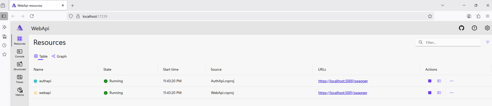

# .NET 9 - Identity Project

[](https://github.com/explorer855/.Net9App/actions/workflows/docker-image.yml)

This project demonstrates user authentication and authorization using **ASP.NET Core Identity**. It includes features like user registration, login, role management, and secure API access.

## 🚀 Technologies Used

- ASP.NET Core 9
- Entity Framework Core
- ASP.NET Core Identity
- SQL Server (or SQLite)
- Swagger (for API documentation)
- Docker
- CI/CD - GitHub Actions

## 📦 Auth API - Project Structure

- `Models/`: Asp.NET Core Identity with models (e.g., `ApplicationUser`)
- `Data/`: EF Core DbContext and migrations
- `Migrations/`: Application DB migrations
- `Controllers/`:  Auth API endpoints
- `Infrastructure/Services/`: Simple Auth Service for User Registeration & Login.
- `Application/Middlewares`: Auth API
- `Application/Validators`: Fluent Model Validators
- `Startup.cs` / `Program.cs`: Auth API Service registrations and Auth middleware setup

## 🛠️ Setup Instructions (Local playgroud)

- Current solution leverages .NET Aspire as the default Container Orchestrator. Open VS Code and run below commands to fire up the solution. Read more about .NET Aspire here: https://learn.microsoft.com/en-us/dotnet/aspire/get-started/aspire-overview

```
dotnet run --project .\WebApi.AppHost\WebApi.AppHost.csproj
```

--- 

